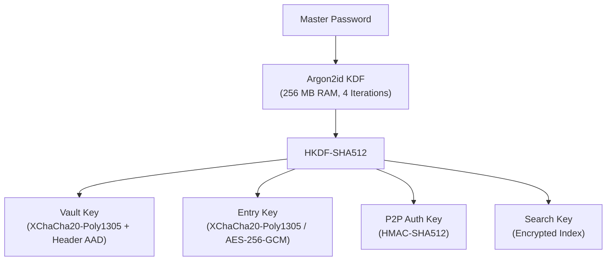
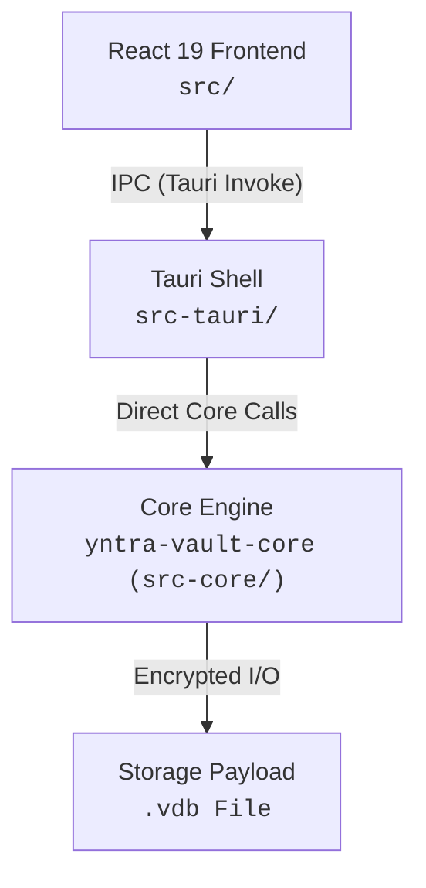

# Yntra Vault

An offline-first, zero-knowledge desktop password manager engineered with Rust, Tauri 2, and React 19.

[](LICENSE)
[](SECURITY.md)
[](docs/architecture/VDB_SPEC.md)
[](https://www.rust-lang.org/)
[](https://tauri.app/)

All credentials remain fully local on your device. Yntra Vault operates with zero cloud servers, zero telemetry, and zero mandatory third-party network connections. Full binary format specification is available in [VDB_SPEC.md](docs/architecture/VDB_SPEC.md).

---

> [!WARNING]
> **Pre-Audit Security Notice**: Yntra Vault is currently in active development. While built using multi-layer defense-in-depth cryptography and strict memory zeroization, the codebase **has not yet undergone an independent third-party security audit**. It is provided for community evaluation and testing. Please review [SECURITY.md](SECURITY.md) for vulnerability disclosure and [docs/security/cryptographic-proofs.md](docs/security/cryptographic-proofs.md) for formal proofs and security invariants.

---

## Key Security & Technical Highlights

### Defense-In-Depth Cryptography Pipeline



* **Single-Pass Authenticated Header**: Header metadata (magic, version, salt, KDF params) is bound as AAD into `XChaCha20-Poly1305`, authenticating header and payload before deserialization.
* **Passkey Support**: Native ES256 (ECDSA P-256) keypair generation and signing per entry.
* **Zeroize Memory Protection**: Critical keys and decrypted fields implement `zeroize::ZeroizeOnDrop`. Memory pages are protected against process dump inspection via platform flags (`prctl` / `SetProcessMitigationPolicy`).

---

## System Architecture



---

## Password & Authenticator Feature Suite

* **Item Types**: Login, Credit Card, Identity, Secure Note, SSH Key, API Key, Wi-Fi, Crypto Wallet.
* **TOTP Authenticator**: RFC 6238 compliant 2FA generator (SHA-1, SHA-256, SHA-512) with visual countdown.
* **Password Generator**: CSPRNG character-set generator + Diceware passphrase engine.
* **Security Audit & Breach Check**: Local vault analyzer for weak/reused passwords + k-anonymity Have I Been Pwned lookup (transmitting only 5-character SHA-1 hash prefixes).
* **Autotype Engine**: OS credential input with field auto-classification (Windows UIA).
* **Encrypted Search**: Trigram-based fuzzy search executed locally without decrypting full entry payloads.

---

## Feature Matrix & OS Compatibility

| Feature | Backend (`src-core`) | Frontend (`src`) | Supported OS | Status |
|:---|:---:|:---:|:---:|:---:|
| Vault Create / Unlock / Lock | `manager.rs` | `CreateVaultModal.tsx` | Windows, macOS, Linux | ✅ Complete |
| Entry CRUD + Custom Fields | `manager.rs` | `PasswordDetail.tsx` | Windows, macOS, Linux | ✅ Complete |
| TOTP Authenticator (SHA1/256/512) | `totp/` | `TOTPDisplay.tsx` | Windows, macOS, Linux | ✅ Complete |
| Passkey Authenticator (ES256) | `crypto/passkey.rs` | `PasswordDetail.tsx` | Windows, macOS, Linux | ✅ Complete |
| Password Generator & Diceware | `generator/` | `PasswordGenerator.tsx` | Windows, macOS, Linux | ✅ Complete |
| Security Audit & Breach Check | `breach/` | `SecurityDashboard.tsx` | Windows, macOS, Linux | ✅ Complete |
| Encrypted Search (Trigram) | `vault/search.rs` | `PasswordList.tsx` | Windows, macOS, Linux | ✅ Complete |
| Autotype Engine | `services/autotype/` | `AutotypeButton.tsx` | Windows (UIA) | ✅ Windows |
| Master Password Re-keying | `manager.rs` | `ChangeMasterPasswordModal.tsx` | Windows, macOS, Linux | ✅ Complete |
| Password History & Rollback | `vault/history.rs` | `PasswordDetail.tsx` | Windows, macOS, Linux | ✅ Complete |
| Shamir Secret Sharing | `crypto/sharing.rs` | — | Cross-Platform | ⚙️ Core Only |
| WebDAV Cloud & P2P Vault Sync | `services/sync/` | `SettingsPanel.tsx` | Cross-Platform | ✅ Complete |
| Command Line Interface (`yntra-cli`) | `cli/` | Terminal TUI (`yntra tui`) | Cross-Platform | ✅ Complete |

---

## Command Line Interface (`yntra` / `yntra-cli`)

Yntra Vault features an ultra-fast, SOTA command-line interface (`yntra` / `yntra-cli`) built with Rust `clap` (v4) and `ratatui` (v0.26).

### CLI Key Capabilities
- **Sub-5ms IPC Session Daemon (`yntra unlock`)**: Keeps unlocked vault state in zeroized memory over local Named Pipe / Unix Socket with `YNTRA_SESSION` token authentication and OS Credential Manager persistence.
- **Secret Injection Engine (`yntra run`)**: Resolves `yntra://<entry>/<field>` references directly in environment variables or `.env` template files (`yntra run --env-file .env.tpl -- <cmd>`) without writing secrets to disk.
- **Interactive Terminal UI (`yntra tui`)**: Ratatui + Crossterm TUI featuring fuzzy search (`/`), Vim navigation (`j`/`k`), live TOTP countdown gauge, modal creation dialogs (`a`), and defended clipboards (`c`/`t`).
- **Developer Ecosystem Protocols**:
  - `yntra git-credential setup`: One-click Git HTTPS credential helper setup.
  - `yntra ssh-agent`: OpenSSH Agent pipe server (`SSH_AUTH_SOCK`) for in-memory SSH authentication.
  - `yntra native-host install <chrome|firefox>`: Chrome/Firefox Native Messaging host installer.
- **Shell Auto-Completions**: Subcommand `yntra completions <zsh|bash|fish|powershell>`.

### Quick CLI Usage

```bash
# Build CLI binary
cargo build --manifest-path src-core/Cargo.toml --release --bin yntra

# Unlock vault session daemon (sub-5ms command latency)
yntra unlock

# Launch interactive Terminal UI
yntra tui

# Inject secrets into process environment
yntra run --env-file .env.tpl -- npm start

# Configure Git HTTPS credential helper
yntra git-credential setup

# Generate Zsh completion script
yntra completions zsh > ~/.zsh/completion/_yntra
```

---

## Getting Started

### Prerequisites

#### 1. Common Dependencies
* **Rust**: `1.75.0` or higher ([Install Rust](https://www.rust-lang.org/tools/install))
* **Bun**: `1.0.0` or higher ([Install Bun](https://bun.sh)) or Node.js 18+

#### 2. System Build Tools (Required for Tauri)
* **Windows**: Visual Studio 2022 C++ Build Tools (`Desktop development with C++`) and Microsoft Edge WebView2 runtime.
* **Linux**: Install development packages:
  ```bash
  sudo apt update && sudo apt install -y build-essential pkg-config libssl-dev libdbus-1-dev libglib2.0-dev libgtk-3-dev libwebkit2gtk-4.1-dev libayatana-appindicator3-dev
  ```
* **macOS**: Install Xcode Command Line Tools: `xcode-select --install`.

---

### Installation & Execution

```bash
# Clone the repository
git clone https://github.com/YntraAB/yntra-vault.git
cd yntra-vault

# Install JavaScript dependencies
bun install

# Launch in development mode
bun run tauri dev
```

### Building Production Installer

```bash
bun run tauri build
```

### Running Test Suite

```bash
# Core unit tests
cargo test --lib --manifest-path src-core/Cargo.toml

# Core micro-benchmark suite
bun run bench
```


---

## Documentation & Format Specifications

* **Security Policy & Vulnerability Reporting**: [SECURITY.md](SECURITY.md)
* **Cryptographic Proofs & Security Model**: [docs/security/cryptographic-proofs.md](docs/security/cryptographic-proofs.md)
* **Storage Format Specification (.vdb)**: [VDB_SPEC.md](docs/architecture/VDB_SPEC.md)
* **Integration SDK & Architecture Reference**: [INTEGRATION-SDK.md](docs/development/INTEGRATION-SDK.md)
* **Reproducible Builds Specification & Verification**: [REPRODUCIBLE_BUILDS.md](docs/development/REPRODUCIBLE_BUILDS.md)
* **Documentation Index**: See [docs/README.md](docs/README.md)

---

## License

This project is open-source software licensed under the [MIT License](LICENSE).
